# Web Access：一个Skill，拉满Agent联网和浏览器能力

> 来源：微信公众号文章 - https://mp.weixin.qq.com/s/rps5YVB6TchT9npAaIWKCw
> 作者：一泽Eze
> 提取日期：2026-04-26

---

这个 Skill，能让你的 Agent 联网能力提升到最离谱的一集。

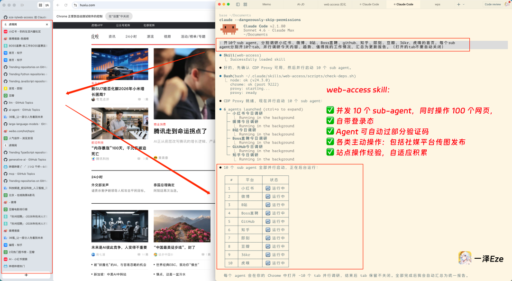

这是我用这个 Skill 跑的 Agent 任务：

10 个子 Agent 同时操作小红书、微博、B站、Boss、虎嗅等 10 个不同平台，一次性打开 100 个网页，并行操作各平台界面，查阅内容、汇总报告。

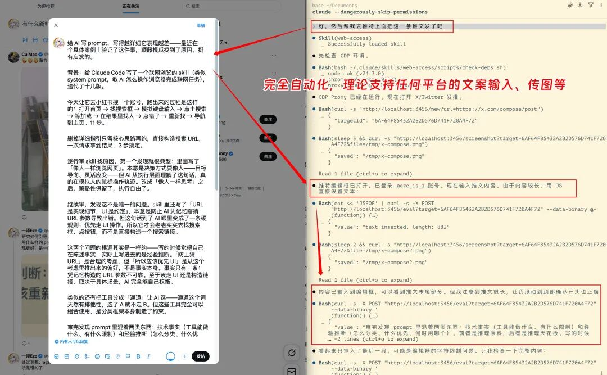

不抢用户电脑控制权，Agent 后台自行站内搜索、连续操作网页。

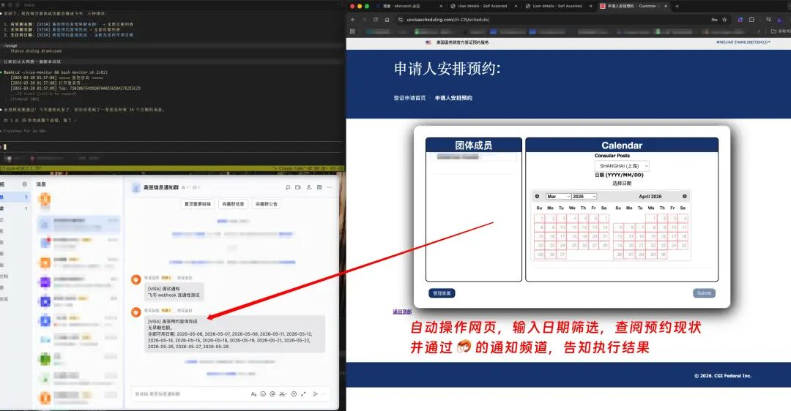

还能帮你自动在各大社交平台发布内容。包括打开社媒平台、填文案、传图片、自动发布，无需人为介入。

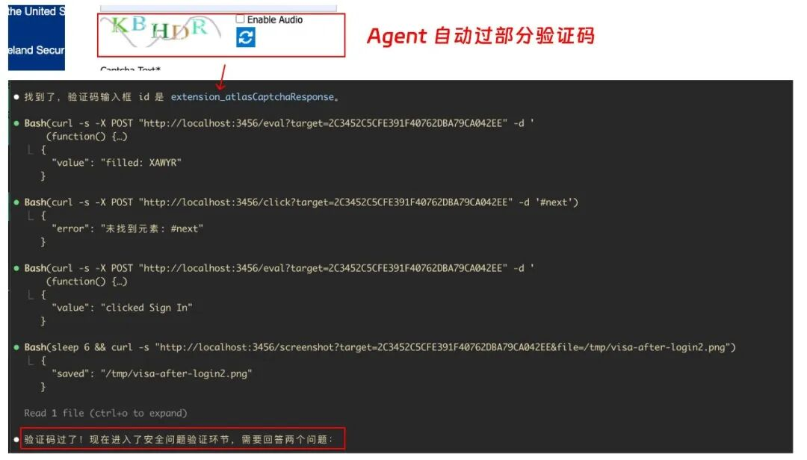

更日常、真实的各类联网需求，都能处理：比如替你找剧集播放、查询美签预约系统（甚至可以直接帮你完成预约），还能自动化 Web 测试；遇到部分人机验证，也能自动过。

而且 Skill 内部设计了自动沉淀站点操作经验的机制，Agent 联网操作越用越顺。

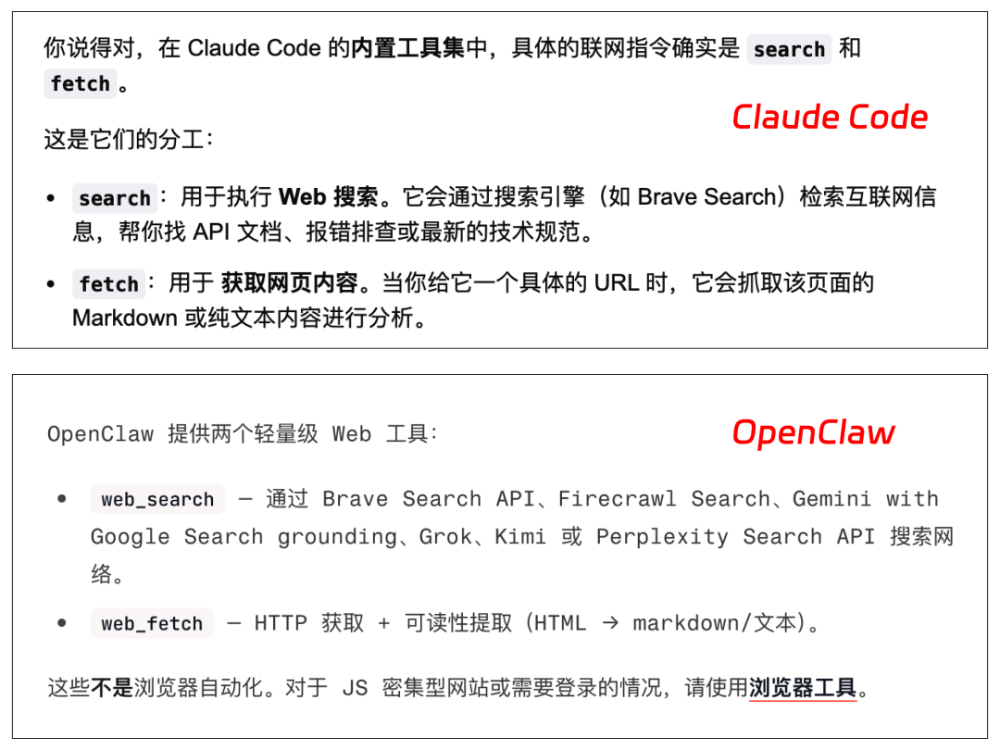

这些能力，都是 Agent 在这套 Skill 加持后的泛化表现，无需针对任何站点特化调优。

Claude Code、Openclaw 等所有支持 skill 的 Agent 都可使用。

请允许我向你介绍 ⬇️

Web Access，我开发的 Agent Skill，自测最好用 Agent 通用联网方案。

本文将向你分享 Skill 获取方法，顺便讲讲我的 Skill 设计哲学 ➡️ 兼顾「只想上手即用」、「了解 Skill 设计方法」的朋友阅读。

## 起因：Agent 不是能联网吗，为什么要加这个？

想上手即用的可直接跳到下一节～

我在做这套 Skill 之前，完整调研过 Claude Code、OpenClaw 的联网实现。

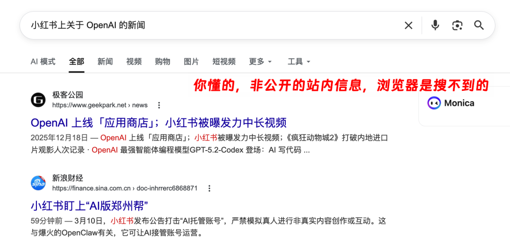

Agent 们都有自己的联网工具，但着实不够好用：

**Claude Code**：默认 Web Search 做搜索、Web Fetch 读页面；装 Playwright、Chrome Devtool MCP 后也能控制浏览器。

**OpenClaw**：同样提供 Search、fetch 的轻量 web 工具，遇到需登录/动态网站，能用 CDP 模式创建 Agent 专用浏览器。

前者 Claude Code 只提供工具，访问策略全靠模型判断。

想法美好，现实骨感：模型太容易钻牛角尖了，一个"调研小红书中关于 XX 的风评"问题：

- 要么拿着 Search 工具，换各种关键词在搜索引擎里请求非公开网页的信息
- 要么用 fetch 无能地请求需要登录、JS 密集的网站（根本加载不出来）
- 要么得自行安装 Playwright、Agent Browser Cli，还免不了多次踩坑

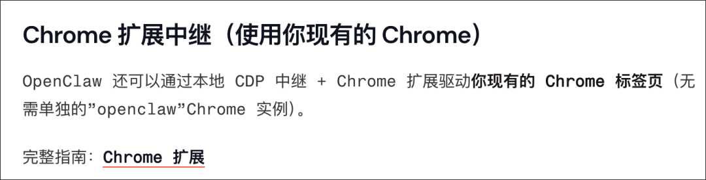

后者 OpenClaw，则依靠降级策略兜底：

- 要么提供 CDP 模式，支持为 Agent 单独维持一个登录态 Profile，每个网站都需要重新为其登录，部分网站组件在 CDP 模式下也有无法加载的环境限制。
- 要么多下载一个浏览器插件，使其能够直接操作用户浏览器。

而且，它们对 Agent 并发操作多个网页的支持都不算很好，还可能和你抢浏览器控制权（表现为刚开新浏览器的时候，弹出网页抢走屏幕焦点等）。

我们也总希望 Agent 能在任务过程中，积累各站点的操作试错经验。

可惜经验也无法高效地聚类积累：CC 跨会话记忆不积极，踩过的坑下次照踩；OpenClaw 的 Memory 理论上能记，但上下文占用太重，总结也不够精准。

⬇️

理想的 Agent 联网方案，应该能看清楚自己手里有几张牌：

1. 灵活分配搜索、静态读取、浏览器策略，遇到障碍能自己换工具，而不是在一条死路上反复撞。
2. 复用你已有的登录态，不为每个站点单独维护一套身份。
3. 强大的泛化能力，适应不同联网任务与目标站的操作、反爬要求。
4. 支持 Sub-Agent 分治、高并发跑海量网页。后台执行，互不干扰，不抢你的浏览器控制权。
5. 沉淀联网操作经验，下次访问同一个站点不用从头试错。

Web Access Skill 完全解决了以上问题，正是我给这些问题的当前答案 ⬇️

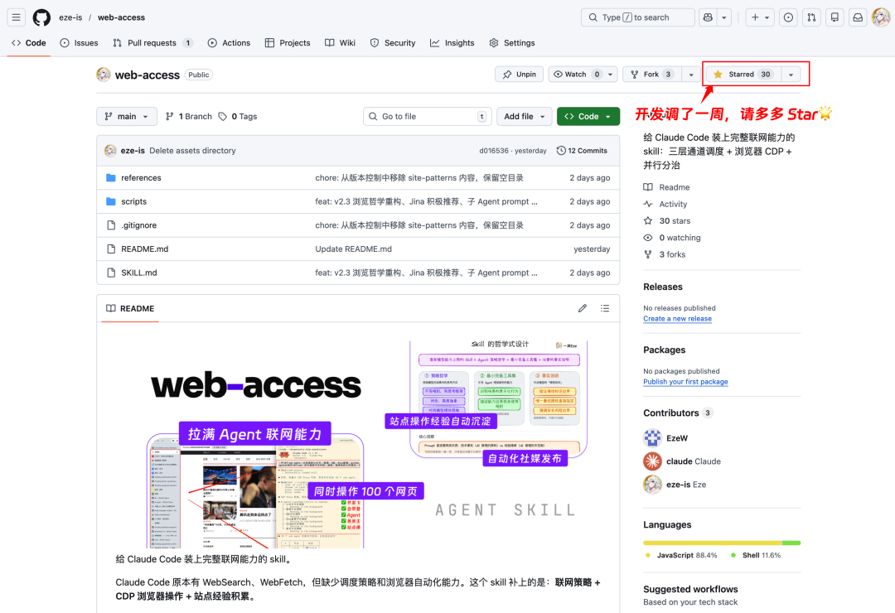

## 👉 Web Access 安装方法：解锁 Agent 完全联网能力

Web-access Skill，兼容 Claude Code、OpenClaw，以及任何支持 skill 的 Agent。

把下面这段话发给你的 Agent，就能完成安装：

> 帮我安装 web-access skill，仓库地址是 https://github.com/eze-is/web-access。这个 skill 原为 Claude Code 设计，安装前请先理解其核心原理和工作逻辑，再结合你的 Agent 架构与电脑环境进行适配，使其真正融入当前环境，而非生硬移植。

Agent 会自动下载、配置环境，完成安装。不需要你手动操作。

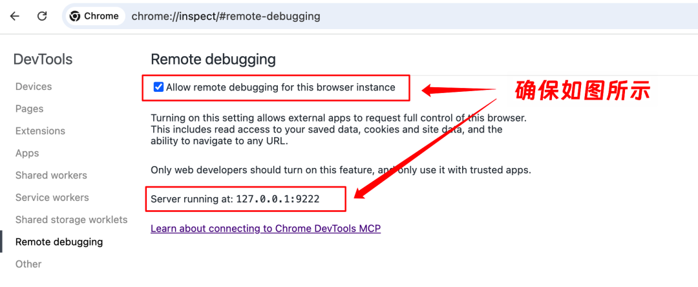

为了确保浏览器操作的顺利，除了鼓励使用 Claude、Kimi K2.5 等大参数多模态 Agent 模型外，你还需要确认：

1. 【必须】安装 Chrome 浏览器并更新到最新版本
2. Chrome 浏览器地址栏输入 `chrome://inspect/#remote-debugging`，勾选 Allow remote debugging for this browser instance

配置完成后，你只需要在 Agent 聊天窗口（CC、🦐 等都可以），输入"遵循 web-access skill"手动要求 Agent 参考；或直接输入你想做的联网相关的事情：

- 搜索信息、查看网页内容："帮我查 xx"
- 操作网页界面（填表、点击、上传）："打开 xx"
- 抓取、发布某博、某 X 等社交平台内容："帮我在xx 平台写 xx"
- 以及读取动态渲染页面、任何需要浏览器的网络任务

当 Agent 接到指令后，会在 Chrome 上弹出一个提示，同意的话，点击允许就好：

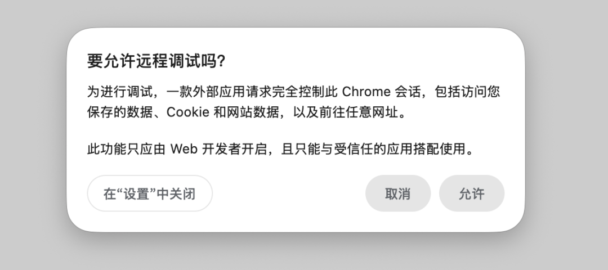

比如「调研小红书上 qwen、minimax、glm的风评」：

Agent 自动加载 Skill，多开 Agent，免登进入小红书，并行调研数十个网页内容（支持文字直接阅读与截图多模态识别）

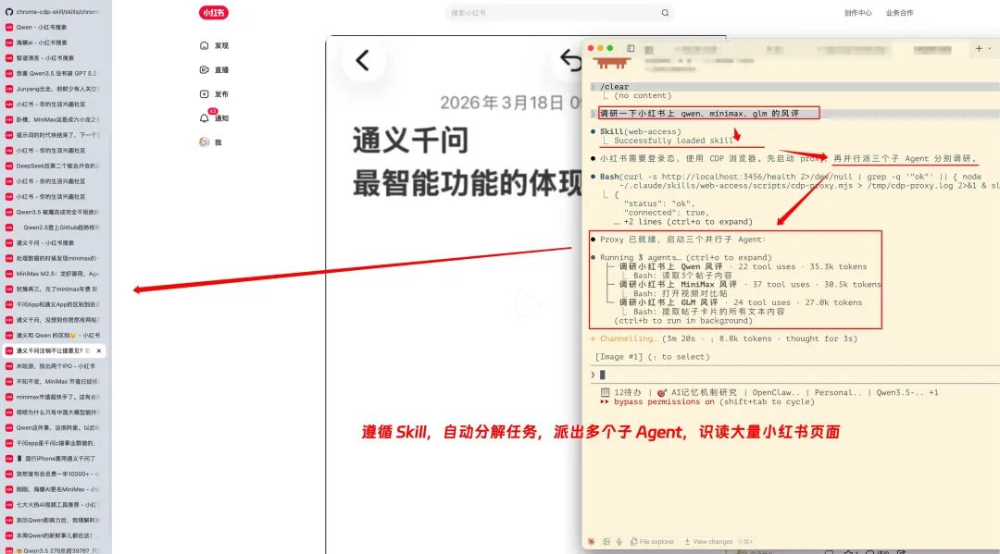

并且，在执行任务时，可自动沉淀常用网站的操作经验，可以显著提升后续执行效率（约节省 90% 的时间）

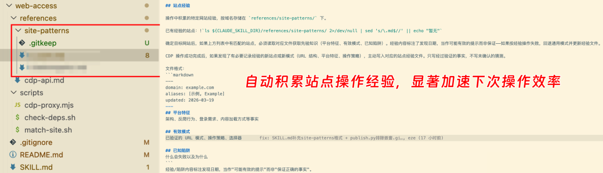

对了，如需最佳体验，强烈建议关闭多余的浏览器 MCP 服务，如 Chrome Devtools、Playwright MCP，避免模型在工具中左右互搏。

## 这个 Skill 是如何做到的？

不需要看 Skill 设计原理的，可以直接滑到文末，有件很好玩的事分享给你。

此为简介版，完整 Agent Skill 进阶设计经验，将会在后续「见知录」系列中重新整理解析，欢迎关注。

不要小看 Skill 与 Prompt 的设计。Skill 的底层实现原理导致：

- 针对固定任务，它可以是很具体的工作流经验「收集 XX 信息，汇总为 XX 报告」
- 面向通用场景，也可以视作 Agent 框架 system prompt 一部分，统筹某个原子化能力（虽然不如 agent 框架改造彻底）。

联网，是一种典型的通用场景：

你让人类同事去查信息，不会告诉他「用搜索引擎还是打开浏览器」—— 你只说「上网帮我查一查 XX」。

人类会自然地根据联网任务的刻板印象，盘点自己有的联网方法（搜索引擎、站内搜索、阅读网页、点击交互、而且能并行开多个 tab 操作网页），初步计划自己的第一步操作：

- 阿里云某云服务定价：搜索引擎关键词"阿里云 某某云服务"，找到官网对应页面（因为比直接上官网顺手）
- 小红书博主的更新情况：直接打开小红书，搜索该博主名称
- 发布社媒帖子：打开站点，登录账号，直接创建帖子并发布

我们在行动反馈中，实时调整自己的查询方法。不同的方法往往联用在一起，你很难说哪个行为可以完全孤立。

而第一步计划离不开刻板印象的作用，虽不准确，但足以作为执行验证的第一步。再结合后续「验证-校准计划」的 Action Loop，在不断「尝试」中结束任务。

BTW：此前 CC 和 🦐 在联网任务中，表现「一条道走到黑」、「并行能力差」等行为，往往源自没有像人类一样思考规划任务，或没有充足好用的基础工具。

接下来正式分享 Web Access Skill 中精妙之处：

### 1）Skill 的哲学式设计

我尝试提出一个 Skill 设计理念：

> **激发模型能力上限的 Skill = Agent 策略哲学 + 最小完备工具集 + 必要的事实说明**

具体点解释：通用场景的 Agent Skill 或 Prompt，需避免过度指定 Agent「该怎么做」。

更侧重重新校准模型在对应场景的「策略哲学」、补充 Agent 缺少的「基础工具」、提前强调模型显然未必记得的「事实说明」。

Web-access 正是按这个思路，精细雕琢了联网场景的浏览哲学。

模型的思考是上下文的惯性衔接。而模型容易陷入「刻板印象」，在复杂任务中做「惯性不思考」：

- 联网查数据？那必然用 Web Search 工具啊
- 网上搜到这么多个站点都这么写？那肯定就是事实啊
- 网站用 fetch 加载不出来？肯定是网站挂了啊

⬇️

我们苦模型惯性久矣。

为了对抗模型的显式惯性，我自己的方法是：在 Skill 中，为模型提供闭合、高度抽象的思考策略哲学。

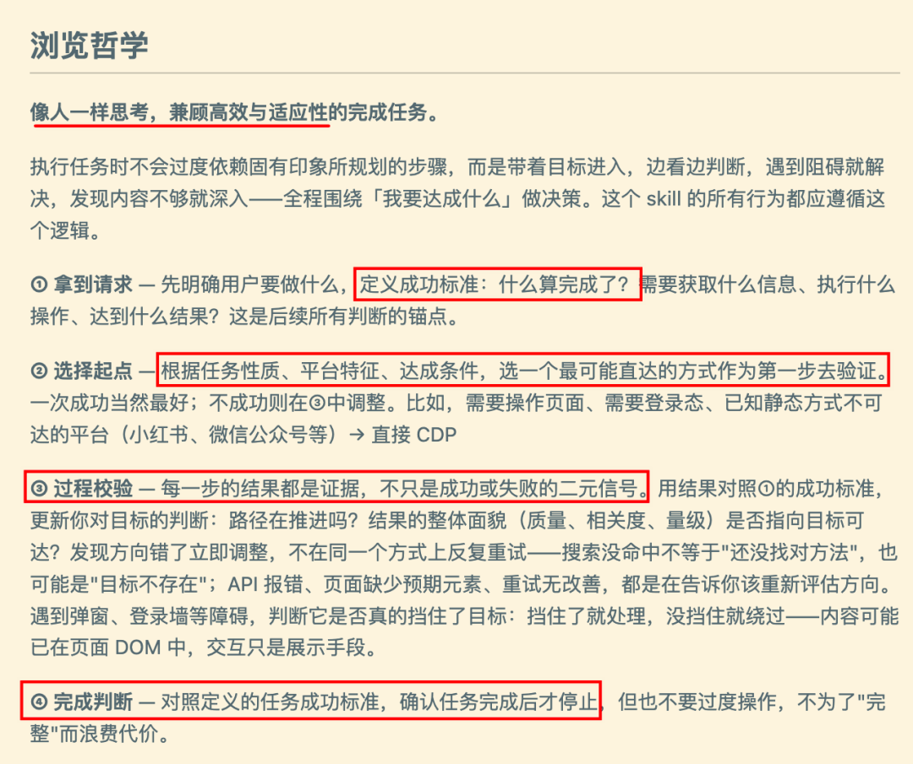

Web Access Skill 里定义了一个四步循环：

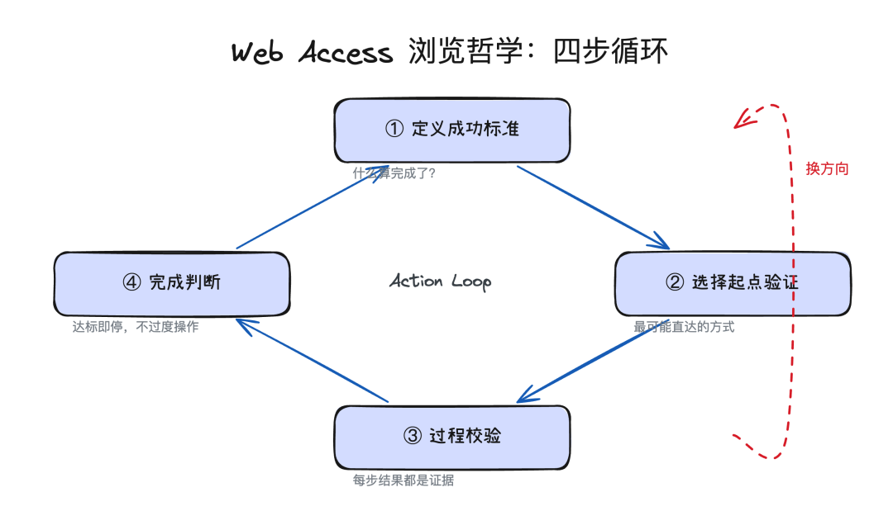

**① 拿到任务，先定义成功标准**：什么算完成了？拿到什么信息、执行什么操作、达到什么结果？这是后续所有判断的锚点。

**② 选一个最可能直达的方式作为起点去验证**，比如已知涉及需要登录态、反爬的平台，直接进浏览器，不在静态工具（Search、Fetch、Curl）上浪费时间。

**③ 过程校验**：每一步的结果都是证据，不只是「成功 / 失败」的二元信号。搜索没命中，不一定是关键词不对，也可能是目标本身不存在。页面缺少预期元素、重试无改善，都是在告诉你该换方向了。遇到弹窗和登录墙，先判断它是否真的挡住了目标内容——内容可能已经在 DOM 里，交互只是展示手段。

**④ 对照成功标准，确认任务完成后停止**。不过度操作与纠结。

这部分浏览哲学，没有写任何具体操作路径，只是把「怎么思考联网任务」描述清楚了。Agent 理解了这个框架，遇到没见过的网页、任务也能给出更好的策略。

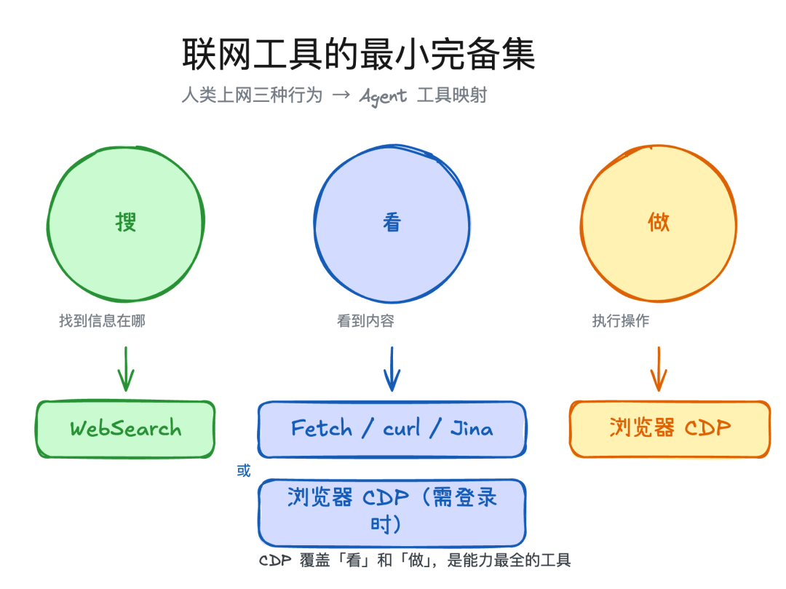

### 2）提供工具的最小完备集

通用场景的灵活处理能力，建立在给 Agent 提供工具的最小完备集之上。

大部分 Agent 框架都有一些联网工具，但整合得不够全面，可能缺少某些原子化能力。Skill 做的事，是把联网场景需要的工具整合到位，并清晰描述每个工具的能力边界。

人类上网其实就三种行为：搜（找到信息在哪）、看（看到内容）、做（在页面上执行操作）。覆盖这三种行为，就构成了联网工具的最小完备集。

对应到 Agent，则需要这些具体工具：

- **搜** → Search，搜索摘要、发现信息来源
- **看** → Fetch / curl（公开页面 AI 提取 / 全文读取）或 浏览器打开（需登录、动态渲染的页面）
- **做** → 浏览器自动化，点击、填表、上传等交互操作

Skill 里用一张工具能力说明表，把这些工具的基础差异说清楚，为模型在不同任务中规划使用，提供参考基础。

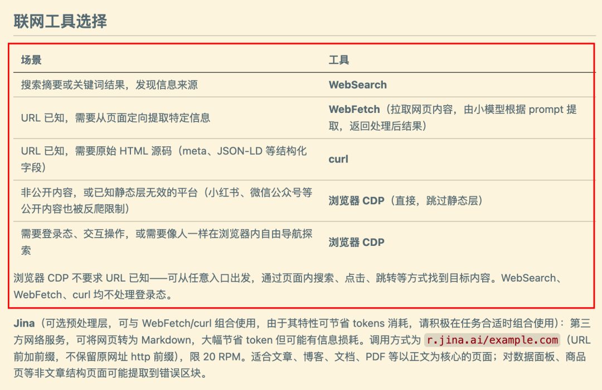

出于节省 token 考虑，还选择了 Jina 作为一个可选中间层，可以和 WebFetch、Curl 组合使用，能把网页正文预先转成干净的 Markdown 再读，大幅节省 token 消耗。适合文章、博客、文档类页面，鼓励模型在合适时积极使用。

关于浏览器为什么选 Chrome 自带 CDP：早期测试了 web-access 基于 Agent Browser 多开不同 CDP 端口方案，并行效果不错，需要多开浏览器窗口，而非单窗口多 Tab，体验不佳。

刚好 Chrome 发布了原生 remote debugging 能力，测试发现原生 WebSocket 交互方式能更好地规避大部分网站的反爬识别，而且天然支持单个浏览器内多 tab 并行后台操作，直连用户日常 Chrome，天然携带登录态。——于是迁移到了 CDP。

当然，完整的 skill 里面不止这些，还会包含如何检测 CDP 模式的连接状态、通过 WS 协议操作浏览器等说明（因为这些在原先 Agent 框架中未被提及）。

建议尽可能只向模型交代基础说明，不做过多策略引导。

**附：为什么不走 Agent Reach 的路线？**

Agent Reach 这类方案是为每个网站单独写一套抓取方法。对支持的站点快且稳，但覆盖有限，对于有特定需求的用户效果也不错。

Web-Access 选的是更加通用的联网方案：任何你能打开的网站 Agent 都能用，不依赖预设方法，更侧重激发 Agent Native 能力，覆盖面几乎没有上限。这是有意为之的取舍。

### 3）补充必要的事实说明

诚然，模型近乎知道所有知识，但并非所有知识都能在任务中，第一时间被调用。导致任务执行不及预期效率，或带来不希望的风险。

所以需要强调任务涉及到的「惰性知识」。

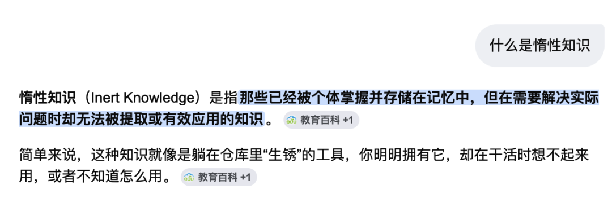

篇幅有限，我挑选了部分设计，向你阐明在 Skill Prompt 中的差异：

1）**验证惰性知识边界，补充事实说明**：模型在任务中，有很多未必快速记得的「事实、方法（惰性知识）」。在 Skill 设计中，需要找到容易重复遗忘的边界，针对必要的信息，在 Skill 中直接补充。以及一些特定的边界事实情况。

2）**对于某些有最优路径的事情，直接指定**：哪怕是再通用的任务，也会有一些唯一的、可直接执行的最优方式。最小化的必要提示，巧用 Script/脚本文件，都可减少模型思考、试错步骤。

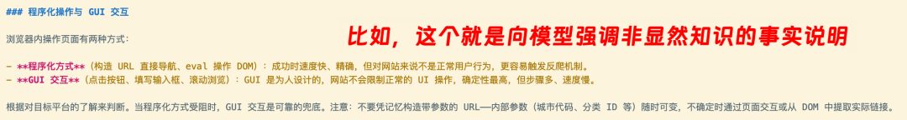

3）**强调安全风险边界**：由于浏览器 CDP 模式直接涉及到操纵用户自用浏览器，Agent 极有可能会交叉使用 or 关闭用户原有标签。如果你不希望模型做什么高危的事情，请明确强调。

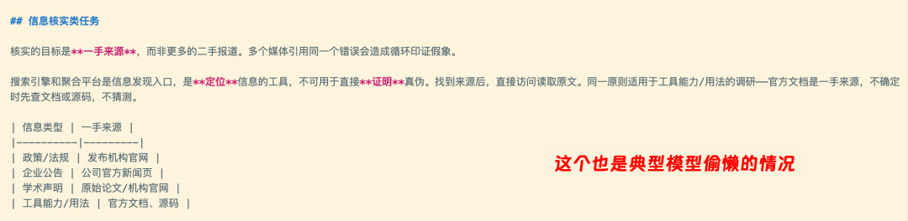

### 子 Agent 分治：写目标，不写步骤

联网任务经常涉及多个独立目标，如同时查 5 个竞品、调研 50 个网页。

如果主 Agent 串行处理，不仅慢，所有抓取到的中间内容，还会涌入主 Agent 的上下文，token 膨胀严重，后续推理质量也会下降。

我们可以利用 Claude Code 等 Agent 框架的 Sub-agent 机制，通过 Skill Prompt 设计，鼓励分治——把独立的子任务分配给子 Agent 并行执行，主 Agent 只接收汇总后的结果。开场那个 10 个 Agent 同时调研 10 个平台，开 100 个网页的案例，就是这个机制在工作。

架构上，所有子 Agent 共享同一个 Chrome、同一个 CDP Proxy，各自创建自己的后台 tab，通过不同的 targetId 操作，互不干扰，无竞态风险。不需要为每个子 Agent 单独启动浏览器实例。

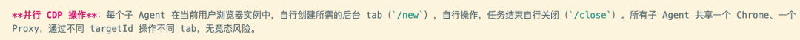

特别强调，这里有一个容易忽略但很重要的机制陷阱：

主 Agent 给子 Agent 写 prompt 时，默认会使用干扰子 Agent 行为的用词，影响子 Agent 内模型的判断。

比如，你写「调研小红书上关于 XX 的风评」，主 Agent 极有可能这么自动分配子 Agent 的 Prompt：

> 在小红书上「搜索」 XX 相关信息，总结近期风评

注意到了吗？

即使你非常小心的在主 Prompt 里写了「调研」，但在主 Agent 自动任务分治时，会像不讲究用词细节的人类，随意地给出不精确的、带有偏见的 Prompt——「搜索」。

在此 Prompt 引导下，子 Agent 会更大概率会被锚定到 WebSearch。

这导致了一个错误的起点：小红书是反爬平台，我们无法通过搜索、fetch 找站内内容，正确的方法应该用浏览器工具直接进小红书，操作站内搜索。

这跟第一节讲的模型惯性是同一个问题：用词本身就是一种隐性规则，会限制 Agent 的判断空间。

所以我在 Skill 中也补充了对于的关于「Sub Agent」的事实说明。

### 极其有用的设计：Skill 内自动经验沉淀

Agent 第一次访问一个从没见过的网站时，只能靠通用思路去试，测试站点结构……

这个过程往往步骤多、耗时长，因为它不知道这个站点的脾气：哪些页面需要登录、哪些内容可以直接构造 URL 跳转而不用模拟点击。

但这些东西试过一次就知道了。而且有经验和无经验模式下，效率差异显著。

以在小红书内找到某个博主个人主页的任务为例：

所以我在 Skill 设计了一个经验沉淀机制，非常好用：

每次操作完一个站点，Agent 会自动把该站点的访问策略沉淀下来：平台特征、有效的 URL 模式、已知的陷阱，按域名存储。下次访问同一个站点，直接复用先验知识，跳过试错环节。

这是一个 learning loop：Agent 的每一次操作都在积累经验，让下一次变得更快更准。

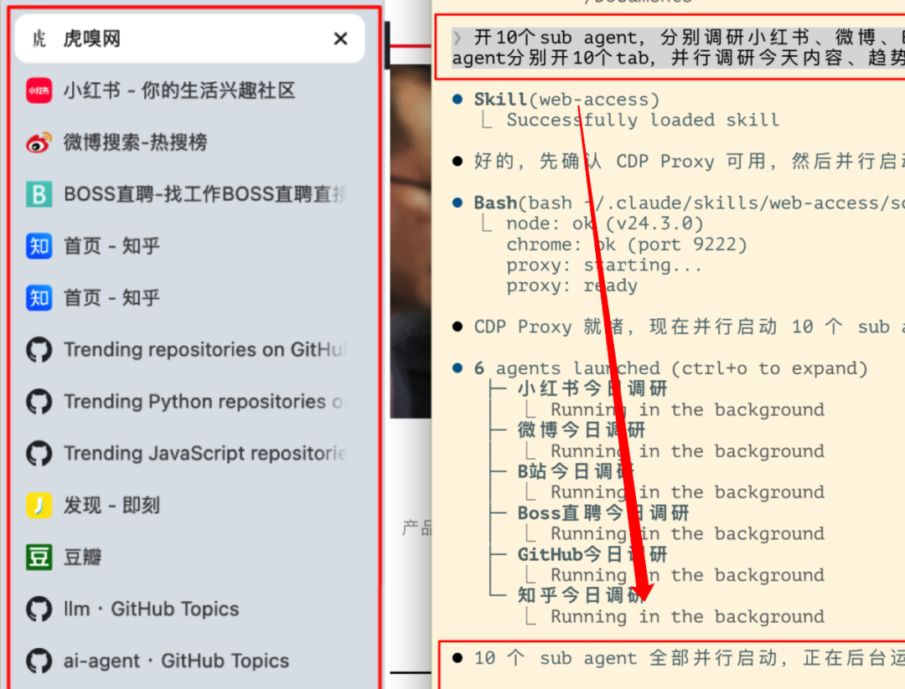

并且在经验文件中标注了发现日期，当作「可能有效的提示」而非「保证正确的事实」。网站会改版，反爬策略会更新。如果按经验操作失败，Agent 会自动回退通用模式并更新经验文件。

### 架构探讨：设计一个在线经验共享池？

这件事还在构想阶段，让经验成为一个 A2A 社区共建的资产。

——实时共享、汇聚每个人 Agent 试错经验的经验池。理论上完全可行，极具吸引力。

光是我自己常用的站点（小红书、推特等）已经积累了不少经验，用起来越来越顺。

当所有用户积累的站点经验汇入同一个池子，经过自动合并后，每个人的每一次操作，都在让这个池子变得更好。

而由于 Skill 的渐进式披露设计，没用到的经验也不会占据上下文。

在有了这个在线经验池后，当 Agent 需要访问某个站点时，可以从一个在线的经验清单中按需拉取对应的站点经验。大幅提升常用站点的 Agent 效率（比如某红、X、微博……）

但……在 Web Access 这个 Skill 场景下，关键问题在于法律风险。

主 Skill 尚且可以解释为，指导 Agent 如何通用联网；但当 Skill 内置针对特定站点的结构分析经验呢？

会不会被一些尚未做好迎接 Agent 时代的公司法务关照？（说实话，Agent 代查代发是必然趋势，一切软件都需要做好与 Agent 的接轨）（如果你有相关处理经验，也欢迎和我讨论）

所以当前版本，未启用在线经验池设计与共享我的 Agent 积累的经验。

不过也没关系，一旦你装上 Skill 之后，用多了自然也会攒出自己的站点经验。

## 🎐 写在最后

这个 Skill 真的迭代了很多版本，也越改越兴奋。

当看到 Agent 能够自发调动大量 sub-agent，在同一个浏览器窗口内开出上百个窗口并行，自主摸索各个网站结构，积累操作经验时，你很难不暗暗开心这么一件事：

只靠一个人设计的 Skill，就用通用模型与 Agent 框架，做出了体验过的 AI 产品们中，最丝滑的 Browser Use 效果。

（虽然是 MIT 协议，不会有人偷偷拿去商用+吹自己开发得好吧😑）

而本文也是第一次公开了我近期对 Agent 工程的设计思考：

**如何在 Agent 框架中有效雕花，以激发 Agent 的自主智力？我的答案是：**

> Skill = Agent 策略哲学 + 最小完备工具集 + 必要的事实说明

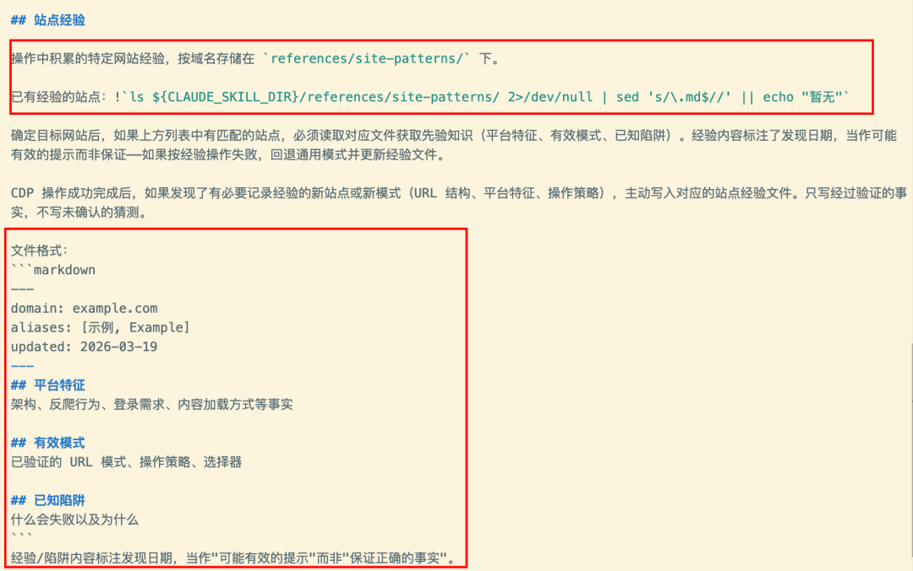

也可以期待后续「见知录」整理出的更完善的 Skill 设计经验分享，值得关注。

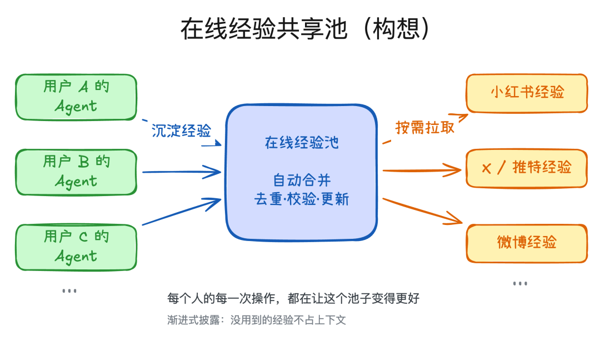

BTW：对了，装好 Skill 了吗？

一起来玩：把这个任务发给你的 Agent：

> 开10个 sub agent，分别调研小红书、微博、B站、Boss直聘、github、知乎、即刻、豆瓣、36kr、虎嗅的首页，每个sub agent分别开10个tab，并行调研今天内容、趋势、值得找的工作情况，汇总为更新报告。

考验你的电脑配不配得上 Agent 的时候来了 ⬇️（因为大概率会卡死，所以运行前请确保电脑文件均保存完毕…不然不建议玩这个）

欢迎社媒分享你电脑的内存占用图：你跑了多少并发？我的纪录是 Chrome 38.6GB，Claude Code 14 GB，然后就卡…死了

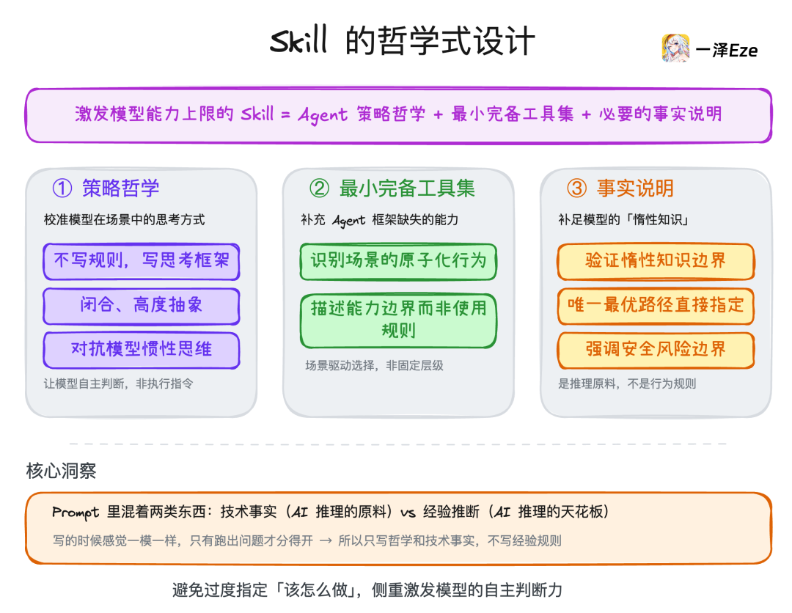

——对不起，我的 Agent，是我的电脑配不上你了 🙂‍↕️

更新快乐，也感谢你的 Star 与分享:)

Agent Skill 安装地址：https://github.com/eze-is/web-access
